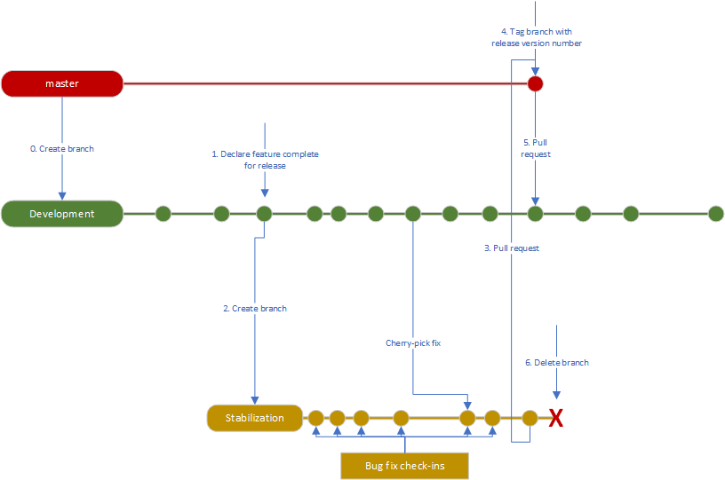

# The Windows Device Portal Wrapper Release Process

The following description and diagram illustrate the process that the Windows Device Portal Wrapper repository undergoes to create a release.

## Release Steps
1. Declare that a release is feature complete.

This will done by / in coordination with the Windows Device Portal Wrapper maintainers.

2. Create a stabilization branch (ex: Stabilization_v1.2.3) off of Development

Bug fixes get submitted to the stabilization branch while work on the next release continues in Development. Note: While not expected in every release, there _may_ be some cherry-picking of individual commits from Development.

The goal is to stabilize rapidly, over the course of approximately one week. If additional time is warrented for a release, we will extend the stabilization window.

3. When the release has stabilized, a pull request is issued from the stabilization branch to master and it is merged.

The pull request should be squashed as part of the merge, with relevant feature and fix comments retained.

During this time, the release is compiled, signed, packaged and submitted to NuGet.

4. The master branch is tagged with the release's version number.

5. A pull request is issued from the master branch into development and it is merged.

No squashing is necessary on this merge.

6. The stabilization branch is deleted.
